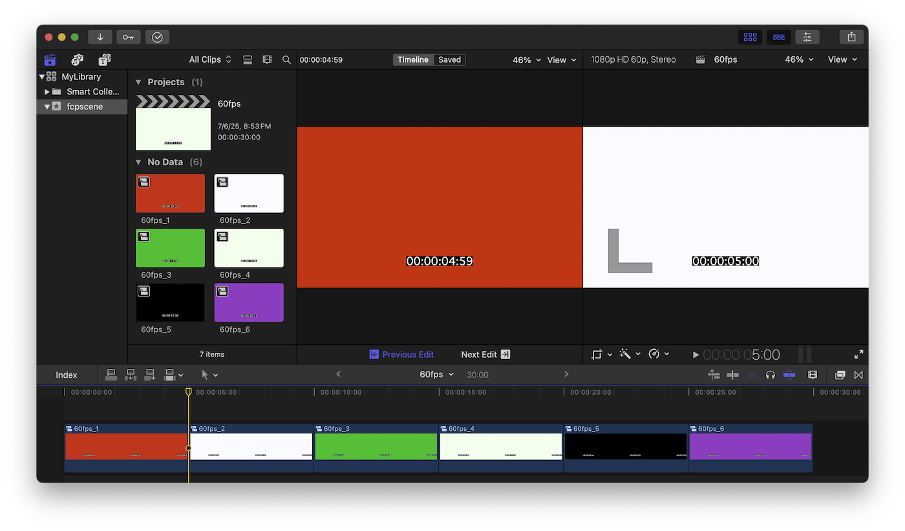

# fcpscene

## Final Cut Pro Scene Detector

This program finds scene changes in videos and generates a Final Cut Pro
project with cuts at those scene changes, using either compound or normal clips.


That example processed a video with five cuts, so the Final Cut timeline has six
compound clips.




## Motivation
I wanted to increase the frame rate of old videos using Final Cut’s Optical Flow
(Machine Learning) interpolation and I faced two main problems. First, it messes
up scene changes by adding a transition — even if the clips are bladed. Second,
it needs hundreds of gigabytes of disk space.

<details>
<summary>Third minor problem</summary>

Changing frame rate in FCP messes up clip boundaries, but that’s solvable
pre-encoding in ProRes. By the way, FCP doesn’t support changing frame rate, but
we can create a new project with the desired frame rate and paste the old
project timeline there. </details>

To solve those problems we need to send individual clips to Apple
Compressor, and let it process the frame rate change and interpolation. But how?

First, we’d have to tediously cut the timeline, and then manually wrap each
clip in its own compound clip so we can batch send them to Compressor.

`fcpscene` automates that process.


## Before Installing
I haven’t confirmed it myself, but DaVinci Resolve Studio (the paid version) may
be a viable alternative.


## Installation
`fcpscene` is installed via Homebrew.

1. Install [Homebrew](https://brew.sh)
2. In the Terminal app type:

```shell
brew tap ericfortis/fcpscene
brew install fcpscene
```

Then open Finder and Go &rarr; Go to Folder and type:

**/opt/homebrew/opt/fcpscene/**

There you’ll see the **fcpscene.app**, which
you can move to your Applications folder.


At any rate, you can always launch it from the Terminal by typing:
```shell
fcpscene --gui
```


## Before Running

### 1. Create an event called "fcpscene" in your Library

<details>
<summary>Details</summary>
This is only needed for compound clips. Without that event you won’t see them in
FCP Browser View, which is where you need to select them for batch sending to
Compressor.

Otherwise, you have two options:
1. Load the project again. The first load creates the **fcpscene** event.
2. Or, **Select All** compound clips in the timeline, and **Clip** &rarr;
   **Reference New Parent Clip**. But that appends the word "copy" to their
   names.
</details>


### 2. Place your video in your 📂`Home` or 📂`Movies` directory
<details>
<summary>Details</summary>
Your video file should be in a directory Final Cut Pro can access &mdash; your
📂Home and 📂Movies directories are allowed by default. Otherwise, grant
Full-Disk Access to Final Cut Pro — without it, Final Cut will crash when
importing the project. For example, that will happen if your video is in your
⚠️Desktop, ⚠️Documents, or any other TCC-protected folder, regardless of where
the .fcpxml file is.
</details>

## Running
In the Terminal, launch the program by typing:

```shell
fcpscene-gui
```
A 15-minute 4K 60fps video takes about a minute to run on a 14-core M4. You’ll
see the detected cut times as it runs — if you hit "Stop", you can still export
a Final Cut Pro project file with the cuts found so far.

The sensitivity should be around 65 to 90%. Start with 88% and increase it if
it’s missing cuts. By the way, 1-frame cuts are ignored regardless of the
percent. Note, sensitivity doesn't affect processing speed.

After the project is loaded in Final Cut you can delete the exported `.fcpxml` file.

<br>

## Command-Line Program

<details>
<summary>Details</summary>

## Running the command-line</h2>

```shell
fcpscene ~/Movies/my-video.mp4
```

That example generates an `~/Movies/my-video.fcpxml` project.

Tip: If you don’t want to type the video file path, just drag the
file into the Terminal — it will paste the path for you.


### Options
#### Output filename
Default: `<video-dir>/<video-name>.fcpxml` (i.e., in the same directory the video is in)

```shell
fcpscene my-video.mp4 --output my-project.fcpxml
```

#### Sensitivity
Range: 0-100, Default: **85**

This value sets the frame difference percentage used to detect scene changes.

```shell
fcpscene --sensitivity 70 my-video.mp4
```

#### Proxy Width
Default: **320**

Lower values speed up analysis. This sets the temporary width used to scale down
the video during processing (without modifying the original file).

```shell
fcpscene --proxy-width 240 my-video.mp4
```

### Tip: Batch Processing

In the Terminal, you can type a snippet like this to run `fcpscene` on all the
`.mp4` videos in your 📂`~/Movies` directory excluding subdirectories.

```shell
cd ~/Movies
for vid in *.mp4; do
  caffeinate fcpscene "$vid"
done
```

Typing `caffeinate` is optional. It’s a macOS built-in program that prevents the
computer from sleeping while it’s running a task.

Also, keep your computer in a well-ventilated area. `fcpscene` uses `ffmpeg`
under the hood, which will max out your CPU cores 🔥.

</details>

<br>


## Final Cut Pro Tips

<details>
<summary><b>Joining Clips</b></summary>
In iMovie there’s (Cmd+J), but in Final Cut we don’t _join_ clips, we _delete_ cuts.

1. Pick the Trim Tool (T)
2. Select both edges by clicking between two clips
3. Hit **Delete**

Alternatively, you can drag each clip edge until it touches the adjacent one to
remove the cut.


</details>

<br/>


<details>
<summary><b>Batch Clip Rename</b></summary>

1. Select the clips you want to rename
2. Window &rarr; Show in Workspace &rarr; Inspector (Cmd+4)
3. Go to the ⓘ Info Inspector Tab (Ctrl+Tab)
4. Type a name


</details>


<br>

## Alternative Tools

#### Davinci Resolve Studio
In Davinci Resolve Studio, the paid version, you can run scene detection and export to Final Cut Pro.

#### Different Approach
Instead of cutting the timeline, there are many tools for splitting the video into small videos.

<details>
<summary><b>Kdenlive</b> (for programmers)</summary>

**Caveats**: There are many 1-frame-off cuts due to rounding errors. Especially with non-integer frame rates such as 29.97
- Drop the video into the Project Bin &rarr; Right-click &rarr; Clip Jobs &rarr; Automatic Scene Split
- Expand the video on the Project Bin &rarr; Select all sequences &rarr; Drop them to the timeline
- File &rarr; OpenTimelineIO Export
- Convert the `.otio` to `.fcpxml` with [this Python adapter](https://github.com/OpenTimelineIO/otio-fcpx-xml-adapter)
</details>


<br>

## License

[MIT](LICENSE) © 2025 Eric Fortis
