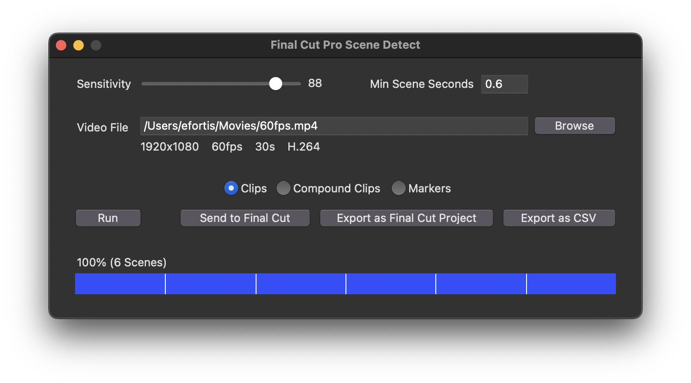
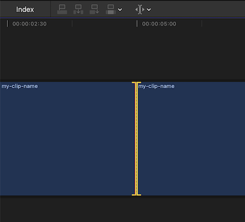
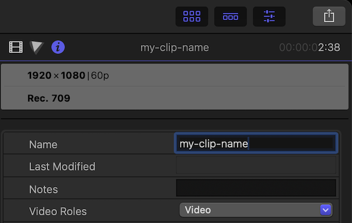

# Final Cut Pro Scene Detector (fcpscene)

This program detects scene changes in videos and generates a Final Cut
Pro project file (FCPXML) with a timeline "bladed" at the scene changes.

For example, the timeline below has six clips (five cuts).


<br>

## Installation

1. Install [Homebrew](https://brew.sh)
2. In the Terminal app type:

```shell
brew tap ericfortis/fcpscene
brew install fcpscene
```


## Place your video in your 📂`Home` or 📂`Movies` directory
You video file should be in a directory Final Cut Pro can access. By default,
your 📂`Home` and 📂`Movies` directories are allowed. **Otherwise, grant
Full-Disk Access** to Final Cut Pro. If not, Final Cut will crash when importing
the `fcpxml` project &mdash; for example, that will happen if your video is in
your ⚠️ _Desktop_, ⚠️ _Documents_, or any other TCC-protected folder.


## Running
In the Terminal, type:

```shell
fcpscene-gui
```

A 15-minute 4K 60fps video takes about 1 minute to run on a 14-core M4. You’ll
see the found cut times as it runs &mdash; if you hit "Stop and Save", a Final
Cut Pro project file with the cuts found so far will be saved 💾.

The sensitivity should be around 65 to 90%. Start with 85% and increase it if
it’s missing cuts. By the way, 1-frame cuts are ignored regardless of the
percent. Also, the sensitivity doesn’t affect speed.




### Importing into Final Cut Pro
Double-click the generated `.fcpxml` file to import it.

Or, import it from Final Cut Pro: File &rarr; Import &rarr; XML &rarr;  Select the generated `.fcpxml`

<br>


## Or, Run the CLI

```shell
fcpscene ~/Desktop/my-video.mp4
```

In that example, an `~/Desktop/my-video.fcpxml` project will
be created. That is, in the same directory the video is in.

Tip: If you don’t want to type the video file path, just drag the
file into the Terminal — it will paste the path for you.


### Options

#### Sensitivity
Range: 0-100, Default: **85**

This value sets the frame difference percentage used to detect scene changes.

```shell
python3 scenes_to_fcp.py --sensitivity 70 my-video.mp4
```

#### Proxy Width
Default: **320**

Lower values speed up analysis. This sets the temporary width
used to scale down the video during processing. It does **not**
modify your original video, and the proxy version is never saved.

```shell
python3 scenes_to_fcp.py --proxy-width 240 my-video.mp4
```

### Tip: Batch Processing

In the Terminal, you can type a snippet like this to run `fcpscene` on all the
`.mp4` videos in your top-level 📂`~/Movies` directory. In other words, this
script will ignore videos in subdirectories.

```shell
cd ~/Movies
for vid in *.mp4; do
  caffeinate fcpscene "$vid"
done
```

Typing `caffeinate` is optional. It’s a macOS built-in program that prevents the
computer from sleeping while it’s running a task.

Also, keep your computer in a well ventilated area. `fcpscene` uses `ffmpeg`
behind the scenes, which will 🔥 max out your CPU cores.


<br>


## Final Cut Pro Tips

### Joining Clips
In iMovie there’s (Cmd+J), but in Final Cut we don’t "join" clips, we "delete" cuts.

That’s done with the Trim Tool (T). Then select both edges by clicking between
two clips, and hit Delete.

Alternatively, you can drag those two edges until they touch the adjacent clip.



<br/>

### Batch clip rename
1. Select all the clips you want to rename.
2. Window &rarr; Show in Workspace &rarr; Inspector (Cmd+4)
3. Go to the ⓘ Info Inspector Tab (Ctrl+Tab)
4. Type a name




<br>

## License

[MIT](LICENSE) © 2025 Eric Fortis
